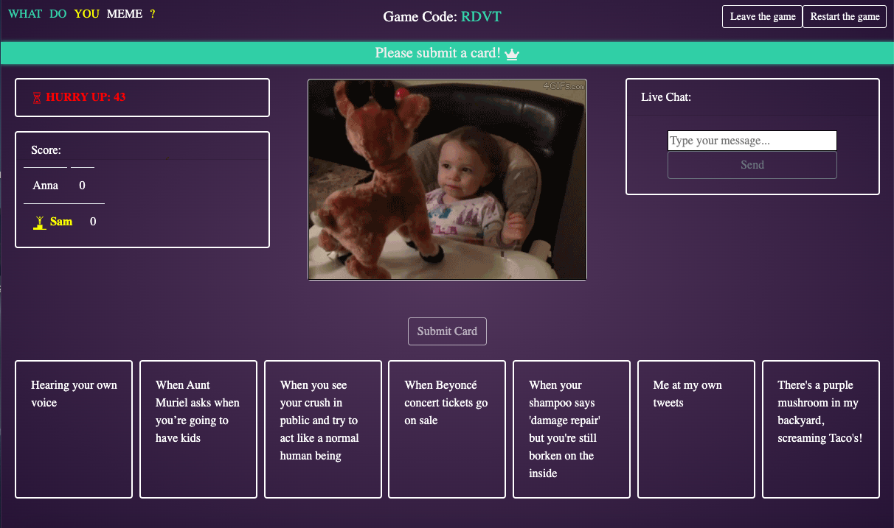

## What Do You Meme - a digital version created by DevProz

Real time multi-player virtual version of the classic card game. Each player will be given a deck of seven unique cards that they have to match against an image card. The player with the best match is awarded one point. Fight for the crown against your friends to find out who can create the funniest memes and grab 5 points first!

[Check out our website here!](https://devproz.herokuapp.com/)

[Watch our screencast!](https://www.youtube.com/watch?v=Xfd3xXaCGpM&list=PLx0iOsdUOUmkqg_8ixMky0s59-C2RJnDB&index=4&t=21s)

Fullstack appplication running on....
MERN stack, Redux, Bootstrap, Socket.io.

 

